# Online Course Website

 

A Web application for an Online Course Website.

 

## Description

 

A web application for courses online platform.

 

## Features

 

* Create course, manage course, upload course material for admin role.
 

* Create Poll, manage poll for admin role.
 

* Comment function for courses and polls.
 

* Comment and Poll history page.
 

* Profile management.
 

## Screenshot Of The App

 

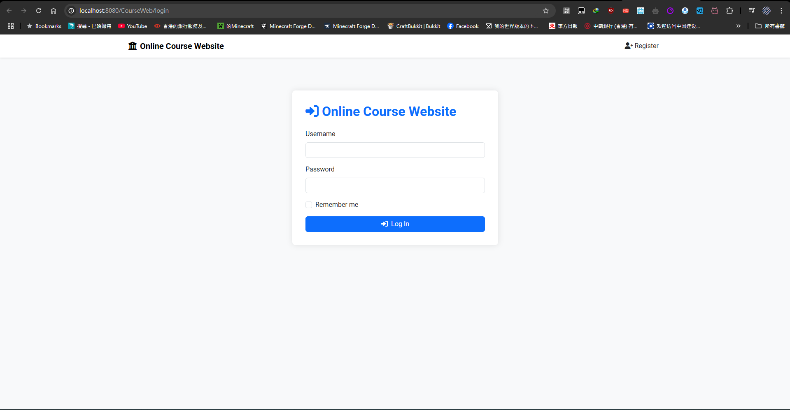

 

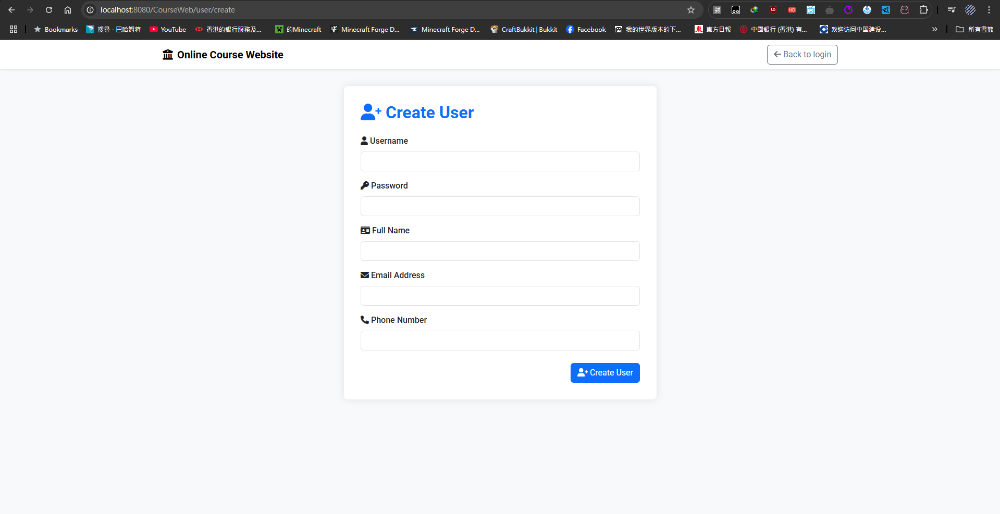

 

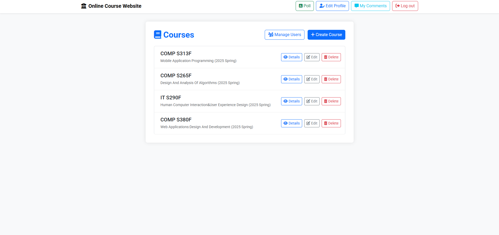

 

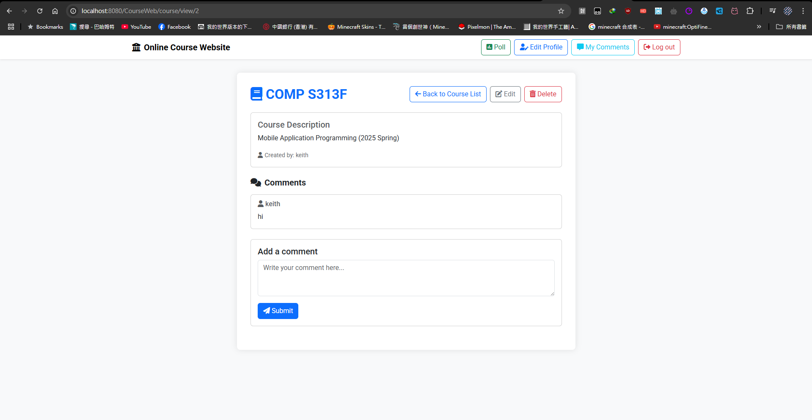

 

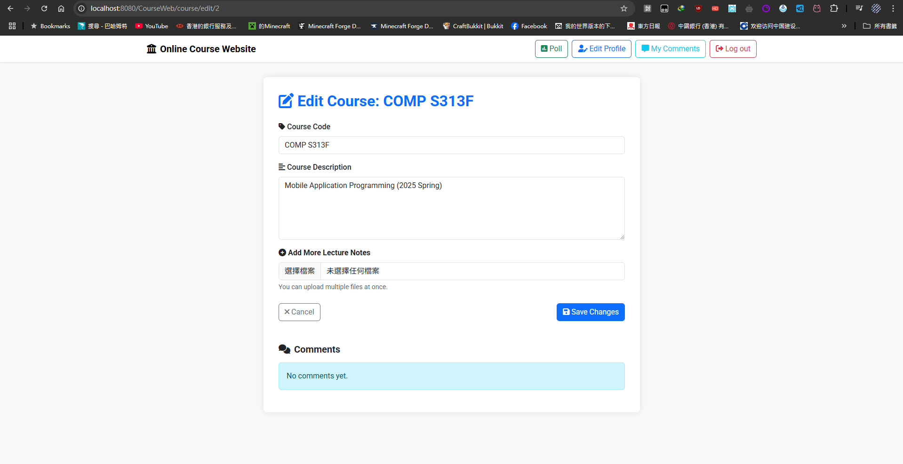

 

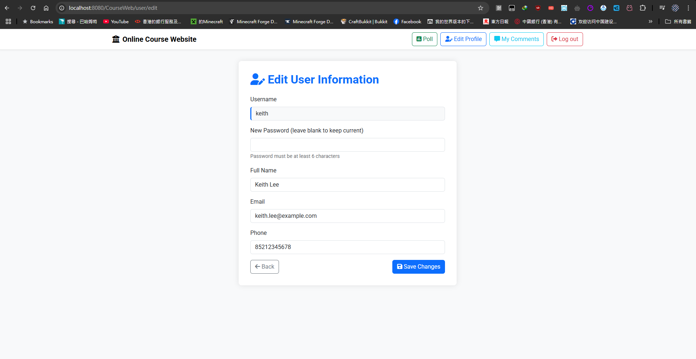

 

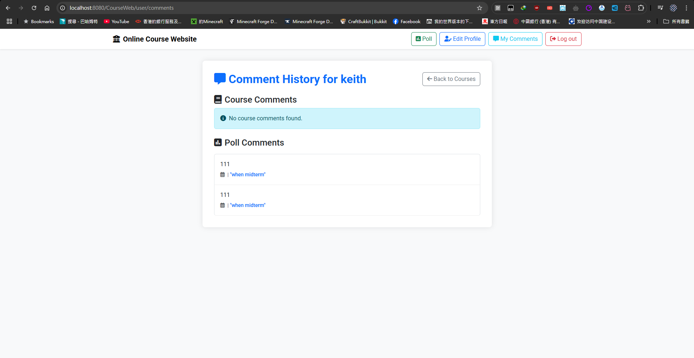

 

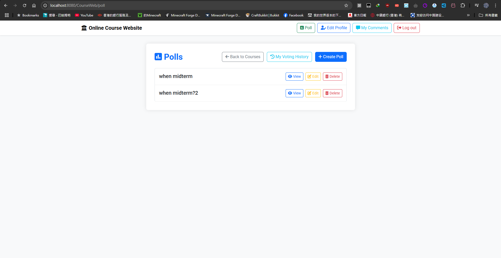

 

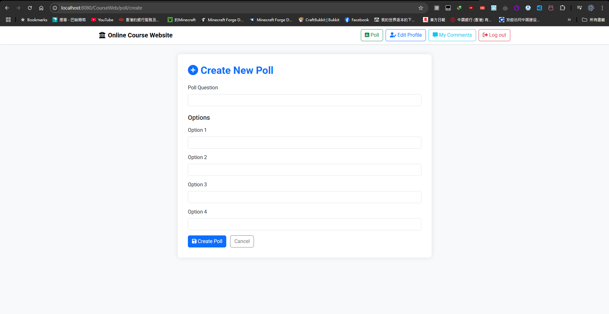

 

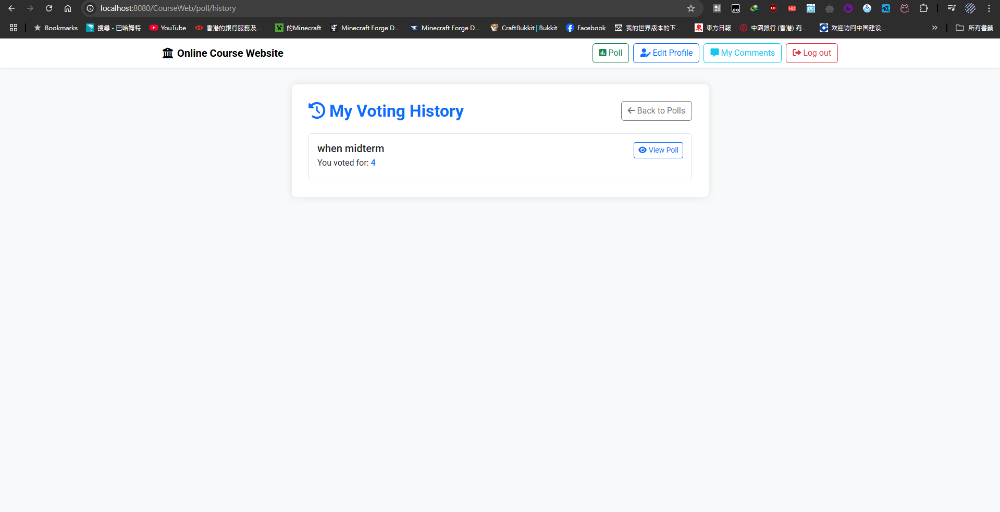

 

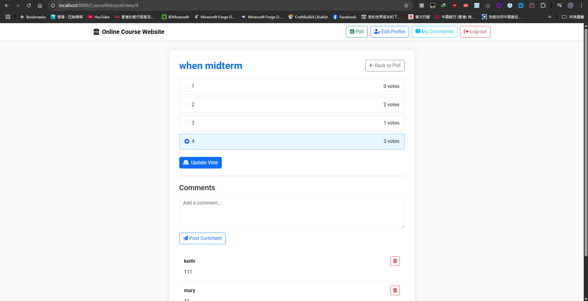

 

## Authors

 

[shamough1792](https://github.com/shamough1792)

 

## Future Planning

 

* 

 

## License

 

This project is licensed under the MIT License - see the [LICENSE.md](LICENSE) file for details

 

## Contributing

 

Contributions are welcome! Please open an issue or submit a pull request for any improvements.

 

## Acknowledgments

 

* [DeepSeek](https://www.deepseek.com/)

 
